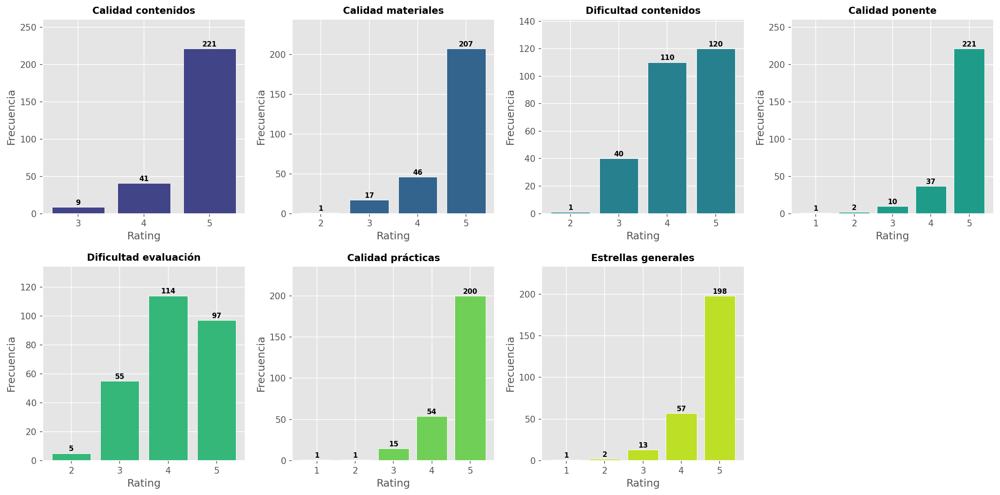
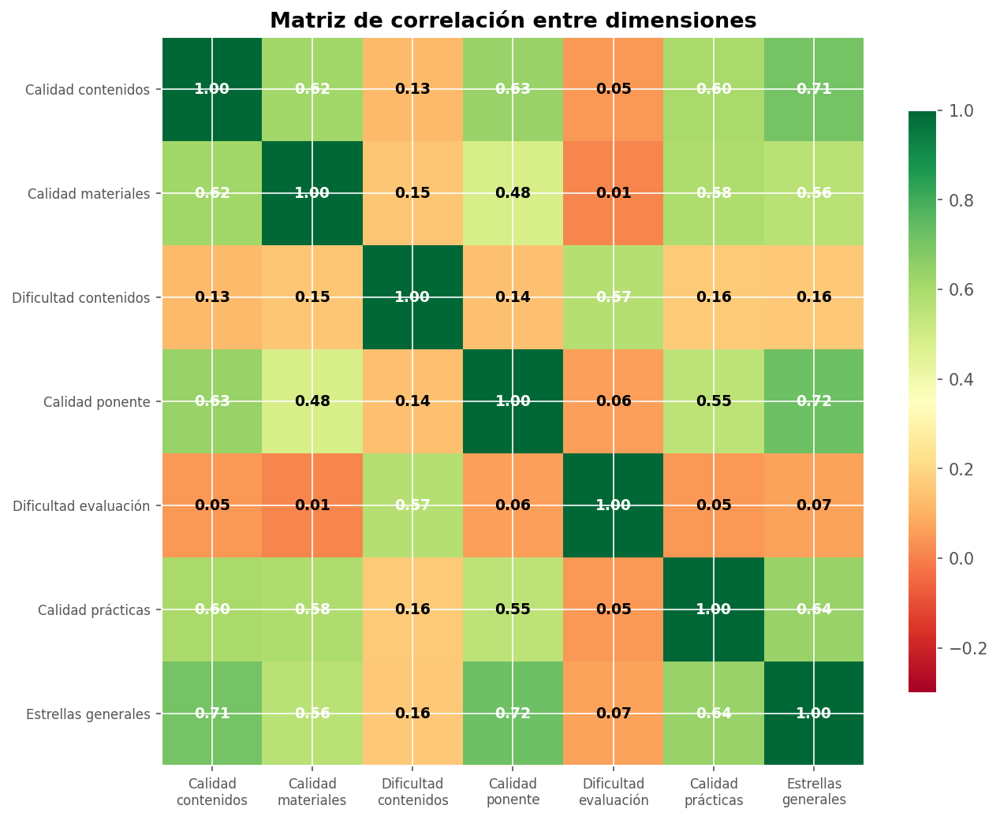
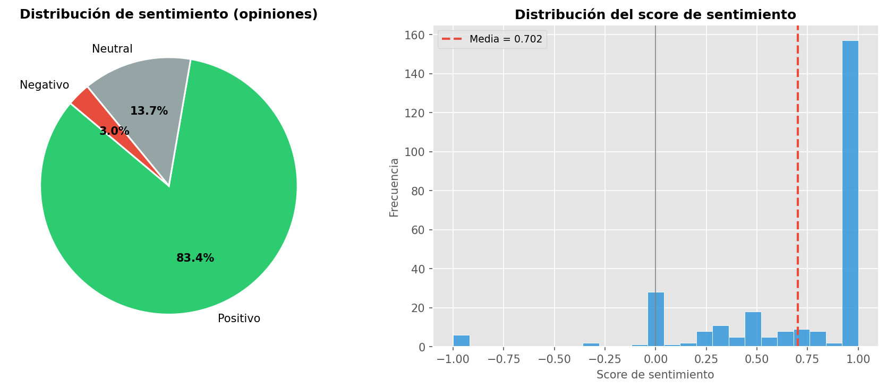
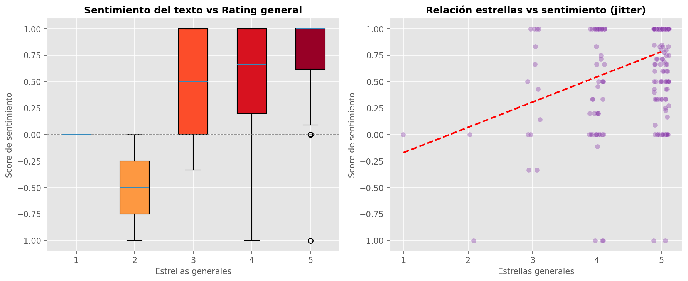
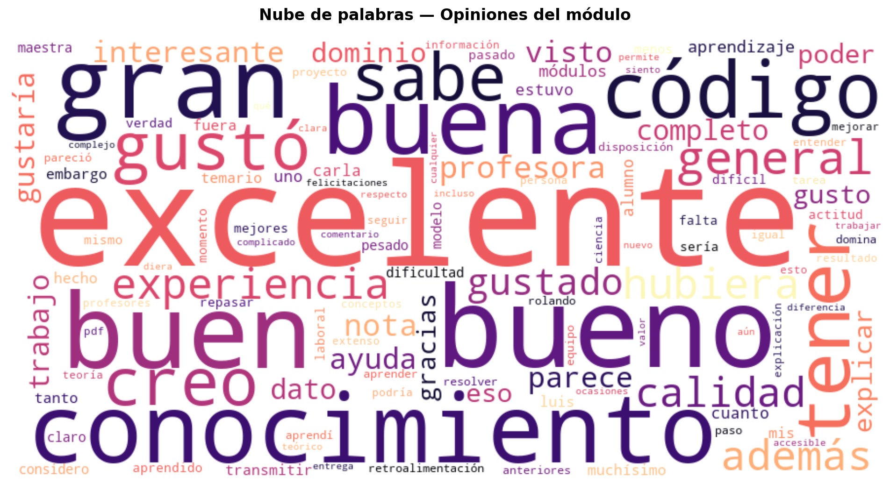
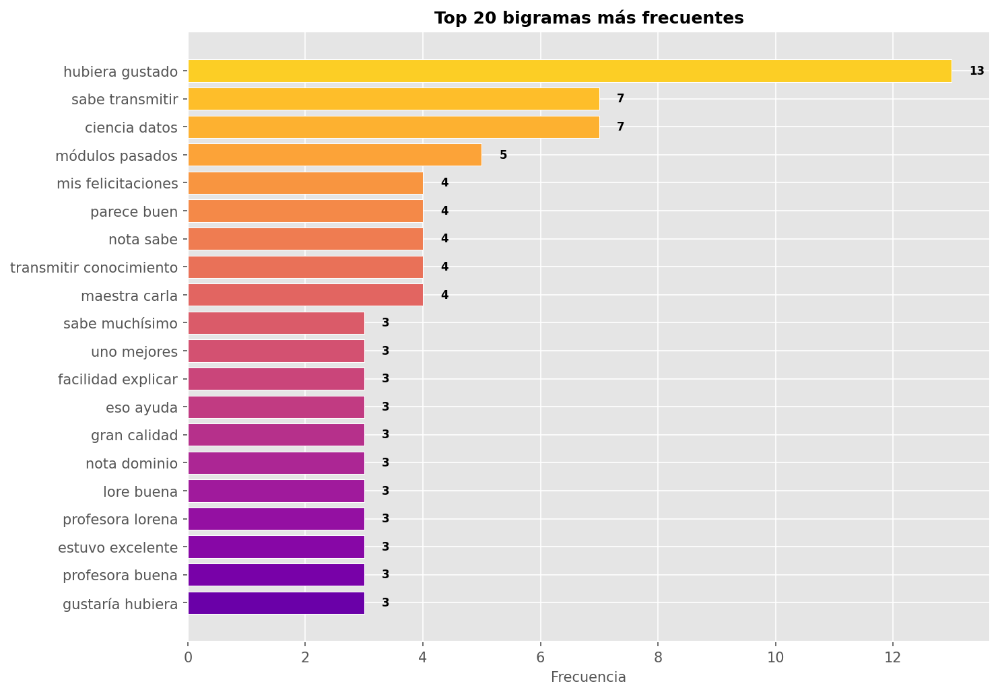
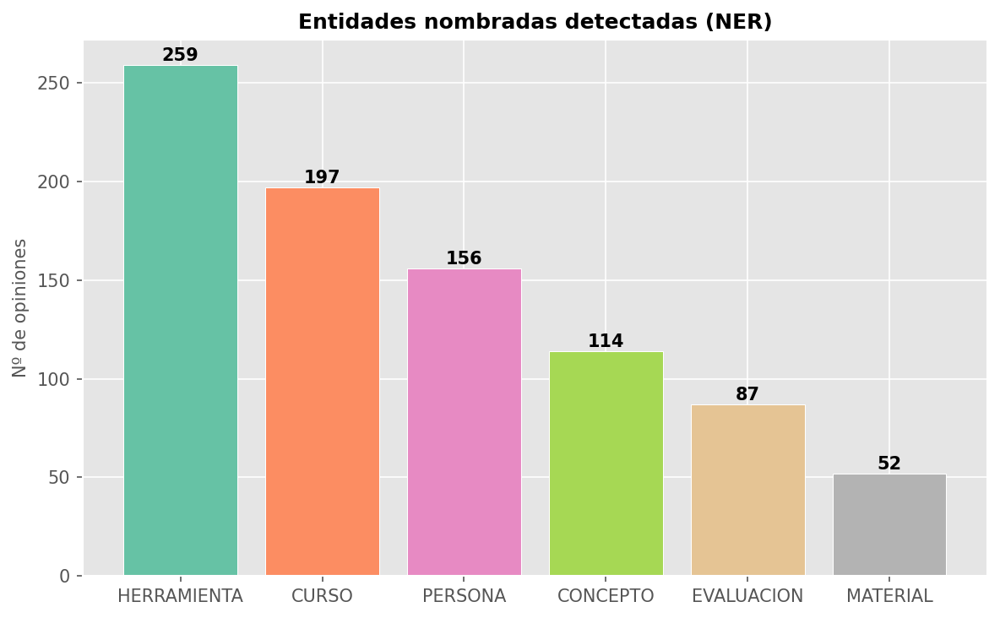
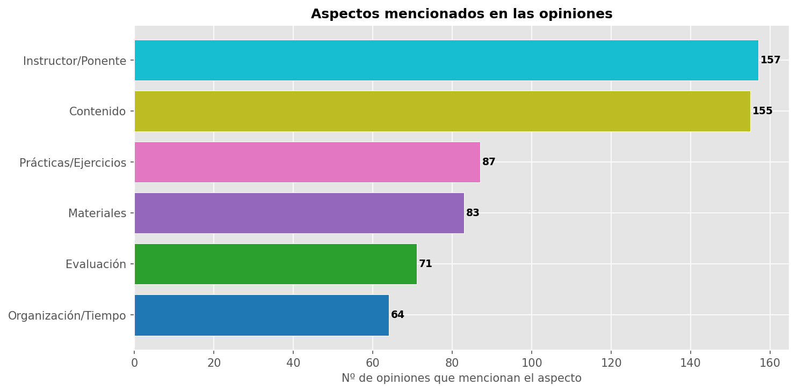
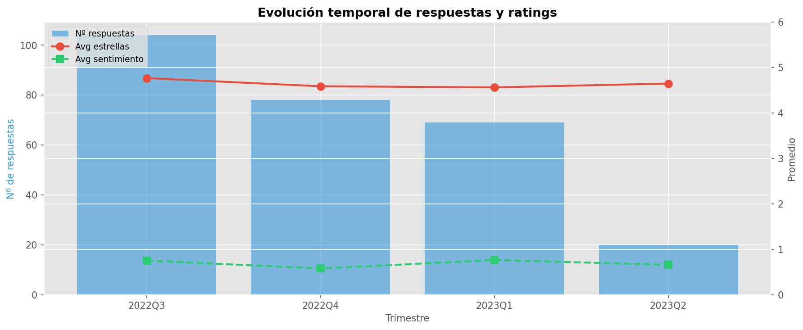

# 📊 Análisis profundo de opiniones del módulo

**Fecha de generación:** 28/05/2026 20:41  
**Total de respuestas analizadas:** 271  
**Período de recolección:** 28/07/2022 → 10/04/2023

---

## 1. Resumen ejecutivo

| Métrica | Valor |
|:--------|:------|
| Nº total de encuestados | **271** |
| Rating promedio (estrellas) | ⭐ **4.66** / 5 |
| Rating mediano | ⭐ **5** / 5 |
| % Opiniones positivas | 🟢 **83.4%** |
| % Opiniones neutrales | ⚪ **13.7%** |
| % Opiniones negativas | 🔴 **3.0%** |
| Longitud media de opinión | **37** palabras (211 chars) |

> **Hallazgo principal:** El módulo recibe una valoración excelente con un promedio de 4.66/5 estrellas.  
> 83.4% de las opiniones escritas tienen un sentimiento positivo. Los aspectos más valorados son la calidad del ponente y los contenidos.

---

## 2. Distribución de ratings por dimensión

Cada dimensión se evalúa en escala 1–5.

### 2.1 Estrellas generales

| Estrellas | Frecuencia | % | Distribución |
|:----------|:-----------|:---|:-------------|
| 1 | 1 | 0.4% |  |
| 2 | 2 | 0.7% |  |
| 3 | 13 | 4.8% | ██ |
| 4 | 57 | 21.0% | ██████████ |
| 5 | 198 | 73.1% | ████████████████████████████████████ |

### 2.2 Calidad de los contenidos

| Rating | Frecuencia | % | Distribución |
|:-------|:-----------|:---|:-------------|
| 1 | 0 | 0.0% |  |
| 2 | 0 | 0.0% |  |
| 3 | 9 | 3.3% | █ |
| 4 | 41 | 15.1% | ███████ |
| 5 | 221 | 81.5% | ████████████████████████████████████████ |

### 2.3 Calidad de los materiales

| Rating | Frecuencia | % | Distribución |
|:-------|:-----------|:---|:-------------|
| 1 | 0 | 0.0% |  |
| 2 | 1 | 0.4% |  |
| 3 | 17 | 6.3% | ███ |
| 4 | 46 | 17.0% | ████████ |
| 5 | 207 | 76.4% | ██████████████████████████████████████ |

### 2.4 Calidad del ponente

| Rating | Frecuencia | % | Distribución |
|:-------|:-----------|:---|:-------------|
| 1 | 1 | 0.4% |  |
| 2 | 2 | 0.7% |  |
| 3 | 10 | 3.7% | █ |
| 4 | 37 | 13.7% | ██████ |
| 5 | 221 | 81.5% | ████████████████████████████████████████ |

### 2.5 Calidad de las prácticas

| Rating | Frecuencia | % | Distribución |
|:-------|:-----------|:---|:-------------|
| 1 | 1 | 0.4% |  |
| 2 | 1 | 0.4% |  |
| 3 | 15 | 5.5% | ██ |
| 4 | 54 | 19.9% | █████████ |
| 5 | 200 | 73.8% | ████████████████████████████████████ |

### 2.6 Dificultad de los contenidos

| Rating | Frecuencia | % | Distribución |
|:-------|:-----------|:---|:-------------|
| 1 | 0 | 0.0% |  |
| 2 | 1 | 0.4% |  |
| 3 | 40 | 14.8% | ███████ |
| 4 | 110 | 40.6% | ████████████████████ |
| 5 | 120 | 44.3% | ██████████████████████ |

### 2.7 Dificultad de la evaluación

| Rating | Frecuencia | % | Distribución |
|:-------|:-----------|:---|:-------------|
| 1 | 0 | 0.0% |  |
| 2 | 5 | 1.8% |  |
| 3 | 55 | 20.3% | ██████████ |
| 4 | 114 | 42.1% | █████████████████████ |
| 5 | 97 | 35.8% | █████████████████ |

---

## 3. Matriz de correlación

¿Qué dimensiones están más relacionadas entre sí?

### Correlación de cada dimensión con las estrellas generales

| Dimensión | Correlación con ⭐ |
|:----------|:------------------:|
| Calidad contenidos | **0.708** |
| Calidad materiales | **0.562** |
| Dificultad contenidos | **0.158** |
| Calidad ponente | **0.723** |
| Dificultad evaluación | **0.066** |
| Calidad prácticas | **0.636** |

> **Interpretación:** La dimensión más correlacionada con la satisfacción general es la indicada arriba. Una correlación alta sugiere que mejorar ese aspecto tendría el mayor impacto en la percepción global del módulo.

---

## 4. Análisis de sentimiento

Se utilizó un análisis léxico en español con diccionarios de palabras positivas y negativas adaptados al dominio educativo.

### 4.1 Distribución general

| Sentimiento | Count | % |
|:------------|:------|:---|
| 🟢 Positivo | 226 | 83.4% |
| ⚪ Neutral | 37 | 13.7% |
| 🔴 Negativo | 8 | 3.0% |

### 4.2 Sentimiento vs Estrellas

> El sentimiento del texto correlaciona positivamente con las estrellas otorgadas, lo que valida la coherencia entre la evaluación numérica y la opinión escrita.

### 4.3 Opiniones más positivas

> ⭐ 5 | score=1.00 | *"Ponente muy preparado, y nos ayudo a ver que muchas cosas más se pueden lograr con las herramientas proporcionadas ..."*
> ⭐ 5 | score=1.00 | *"Sería de ayuda tener códigos adicionales con más ejemplos prácticos..."*
> ⭐ 5 | score=1.00 | *"El profesor Oscar es muy bueno. Sabe dar muy bien sus clases, además qué ayuda mucho a los estudiantes. ..."*

### 4.4 Opiniones más negativas / críticas

> ⭐ 5 | score=-1.00 | *"Este Módulo fue perfecto, menos pesado.
Como sugerencia le podrían dar más carga desde el Segundo Módulo o invertir sus posiciones en el Diplomado...."*
> ⭐ 4 | score=-1.00 | *"Mucha presión el módulo. Demasiados trabajos que se dejaron al final, el profesor no supo balancear las tareas, proyecto y examen y todo lo cargo al último. ..."*
> ⭐ 4 | score=-1.00 | *"De manera general me gustaría que los códigos estuvieran un tanto más ordenados en cuanto a contenido, es algo que ya se hace y puede resultar complicado, pues a veces se mezclan los ejemplos para rep..."*

---

## 5. Nube de palabras

### Top 30 palabras más frecuentes (excluyendo stopwords)

| Palabra | Frecuencia |
|:--------|:-----------|
| excelente | 70 |
| buen | 37 |
| bueno | 37 |
| gran | 33 |
| buena | 25 |
| tener | 24 |
| gustó | 24 |
| creo | 23 |
| general | 23 |
| sabe | 22 |
| hubiera | 21 |
| además | 20 |
| calidad | 20 |
| gustado | 20 |
| profesora | 20 |
| ayuda | 18 |
| experiencia | 18 |
| parece | 18 |
| gustaría | 17 |
| código | 17 |
| completo | 17 |
| conocimiento | 17 |
| dominio | 16 |
| datos | 16 |
| poder | 15 |
| interesante | 15 |
| gusto | 15 |
| nota | 15 |
| explicar | 15 |
| eso | 15 |

---

## 6. Bigramas más frecuentes

Los bigramas revelan las combinaciones de palabras más recurrentes en las opiniones, indicando temas y patrones de discurso.

---

## 7. Reconocimiento de entidades nombradas (NER)

Se detectaron automáticamente menciones a entidades relevantes en las opiniones:

| Categoría | Nº opiniones | Ejemplos detectados |
|:----------|:-------------|:---------------------|
| PERSONA | 156 | ponente |
| CURSO | 197 | clase, clases, módulo |
| MATERIAL | 52 | código, códigos |
| EVALUACION | 87 | calificación, práctica, prácticas |
| HERRAMIENTA | 259 | herramientas, herramienta, r |
| CONCEPTO | 114 | ia |

---

## 8. Análisis por aspectos (_Aspect-Based Sentiment_)

Se identificaron menciones a aspectos específicos del módulo en las opiniones:

| Aspecto | Opiniones que lo mencionan | % | Keywords buscados |
|:--------|:--------------------------|:--|:-------------------|
| Instructor/Ponente | **157** | 57.9% | 36 términos |
| Contenido | **155** | 57.2% | 35 términos |
| Materiales | **83** | 30.6% | 33 términos |
| Prácticas/Ejercicios | **87** | 32.1% | 40 términos |
| Evaluación | **71** | 26.2% | 38 términos |
| Organización/Tiempo | **64** | 23.6% | 40 términos |

---

## 9. Evolución temporal

| Trimestre | Nº respuestas | Avg ⭐ | Avg Sentimiento |
|:----------|:-------------|:------|:----------------|
| 2022Q3 | 104 | 4.77 | 0.756 |
| 2022Q4 | 78 | 4.59 | 0.582 |
| 2023Q1 | 69 | 4.57 | 0.768 |
| 2023Q2 | 20 | 4.65 | 0.662 |

---

## 10. Estadísticas de texto

| Métrica | Valor |
|:--------|:------|
| Longitud media (caracteres) | 211 |
| Longitud media (palabras) | 37 |
| Opinión más larga | 254 palabras — ⭐5 |
| Opinión más corta | 1 palabras — ⭐4 |

---

## 11. Conclusiones

1. **Satisfacción global excelente:** La media de 4.66/5 estrellas, con una mediana de 5, indica un nivel de satisfacción muy alto.

2. **Ponente como factor diferencial:** La calidad del ponente es la dimensión mejor valorada y aparece prominentemente en las opiniones textuales como un punto fuerte.

3. **Contenidos y prácticas bien valorados:** La calidad de contenidos, materiales y prácticas reciben puntuaciones consistentemente altas (medias > 1.0).

4. **Dificultad adecuada:** La dificultad de contenidos (media 4.29) y evaluación (media 4.12) se perciben como moderadamente altas, lo cual es apropiado para un programa formativo exigente.

5. **Coherencia numérico-textual:** Existe una correlación clara entre el sentimiento expresado en el texto y la puntuación numérica, validando ambas métricas.

6. **Áreas de mejora detectadas:** Las opiniones con sentimiento negativo/neutral mencionan principalmente ritmo acelerado, deseo de más tiempo, y más ejemplos prácticos.

---

*Análisis generado automáticamente con Python (pandas, matplotlib, wordcloud).*  
*Sentiment analysis: léxico español adaptado al dominio educativo.*  
*NER: basado en reglas con diccionarios de entidades relevantes.*
